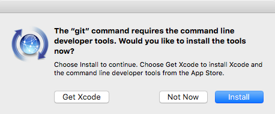
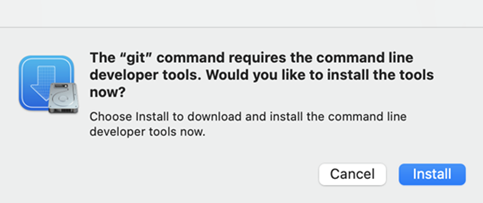

# Git Installation Guide

This guide covers Git installation for **Windows**, **macOS**, and **Linux** users. Once installed, all bash commands are identical across platforms.

---

## 1. Install Git

### macOS

#### Option A — Xcode Command Line Tools (fastest, zero setup)

```bash
git --version
```

If Git is not installed, macOS will automatically prompt:

> "The git command requires the command line developer tools."



Click **Install** to begin the installation:



Accept it → Git gets installed.

#### Option B — Homebrew (preferred for developers)

Install Homebrew (one-liner):

```bash
/bin/bash -c "$(curl -fsSL https://raw.githubusercontent.com/Homebrew/install/HEAD/install.sh)"
```

Install Git:

```bash
brew install git
```

---

### Windows (Git Bash)

> **Note:** Windows cannot install Git via pure bash alone unless a package manager is already installed. The standard approach is **Git for Windows**, which gives you Git Bash.

#### Step 1 — Install Git for Windows (one-time)

1. Download and install [Git for Windows](https://git-scm.com/download/win)
2. During install, select:
   - ✅ "Git Bash Here"
   - ✅ "Use Git from the command line and third-party software"

#### Step 2 — Open Git Bash and verify

```bash
git --version
```

From this point on, all bash commands are identical to macOS/Linux.

---

### Linux

Install via your distribution's package manager:

**Debian/Ubuntu:**

```bash
sudo apt update && sudo apt install git -y
```

**Fedora:**

```bash
sudo dnf install git -y
```

**Arch Linux:**

```bash
sudo pacman -S git
```

---

## 2. Verify Installation (same for everyone)

```bash
git --version
which git
```

---

## 3. (Optional) Configure Git

Set your name and email (used for commits):

```bash
git config --global user.name "Your Name"
git config --global user.email "you@example.com"
```

Check your configuration:

```bash
git config --global --list
```

---

## 4. Create a Projects Folder (same commands)

Pick a place to keep code (recommended: `~/projects`).

```bash
mkdir -p ~/projects
cd ~/projects
pwd
```

> `pwd` prints your current folder so you can confirm you're in the right place.

---

## 5. Clone a Repository (same commands)

### Option A — Clone normally (creates a folder named after the repo)

```bash
git clone <REPO_URL>
cd <REPO_NAME>
```

### Option B — Clone into a specific folder name

```bash
git clone <REPO_URL> my-project
cd my-project
```

### Confirm it worked

```bash
git status
git remote -v
```

---

## 6. Standard "First Time in the Repo" Steps

Pull latest changes (safe habit):

```bash
git pull
```

---

## 7. Quick Reference Template

```bash
# 1) Verify Git
git --version

# 2) Create projects folder
mkdir -p ~/projects
cd ~/projects

# 3) Clone repo
git clone <REPO_URL>
cd <REPO_NAME>

# 4) Make a branch
git checkout -b feature/my-change

# 5) Commit and push
git add .
git commit -m "My change"
git push -u origin feature/my-change
```

---

## 8. Troubleshooting

| Error | Cause | Solution |
|-------|-------|----------|
| `git not found` | Git isn't installed, or terminal isn't Git Bash on Windows | Reinstall Git / open Git Bash |
| `Permission denied (publickey)` | SSH key issue | Add your SSH key to GitHub/GitLab, or clone with HTTPS |
| `Repository not found` | Wrong URL or no access permissions | Verify the URL and your access rights |

---

## Summary

Once Git is installed:

- **macOS** users: Use Terminal (bash/zsh)
- **Windows** users: Use **Git Bash** (installed with Git for Windows)
- **Linux** users: Use Terminal (bash)

All commands from this point forward are identical across all platforms.
